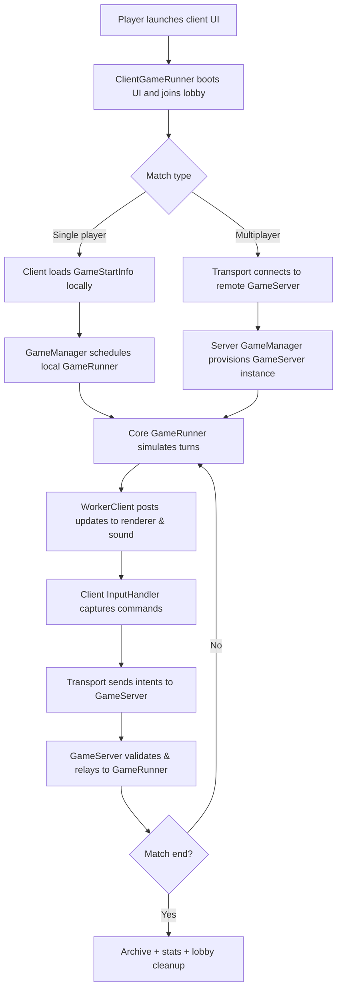

# OpenFrontIO Onboarding & Game Flow Guide

OpenFrontIO is a real-time strategy game where players compete to expand territory, command armies, and collaborate through
alliances. This guide summarizes how to get the project running locally, explains the runtime lifecycle of a match, and
introduces the major modules that power the experience.

## Quick Start Checklist

1. **Install dependencies**: `npm i`
2. **Run full-stack development mode**: `npm run dev`
3. **Client only** (connect to remote or locally running server): `npm run start:client`
4. **Server only** with development settings: `npm run start:server-dev`
5. **Optional**: connect the client to staging (`npm run dev:staging`) or production (`npm run dev:prod`) backends.

Configuration values are read from `.env` files and `example.env`. See `README.md` for deployment-specific scripts and Docker
utilities.

## Flow of a Match

## Gameplay Lifecycle

1. **Lobby creation and matchmaking**
   - The browser client instantiates `ClientGameRunner` and `Transport`, requesting cosmetics, lobby data, and
     `GameStartInfo` from the API. 【F:src/client/ClientGameRunner.ts†L1-L108】
   - The Node server creates or locates a `GameServer` through `GameManager`, seeding default configuration and tracking the
     lobby's phase. 【F:src/server/GameManager.ts†L1-L74】
2. **Prestart phase**
   - `GameServer` transitions to `GamePhase.Active`, issues prestart payloads, and schedules `start()` after a grace period
     so that clients can finish loading terrain maps. 【F:src/server/GameManager.ts†L55-L74】
   - Clients stream terrain metadata through `TerrainMapLoader`, pre-download assets, and configure render targets before the
     first tick arrives. 【F:src/client/ClientGameRunner.ts†L56-L117】
3. **Game execution loop**
   - `createClientGame` resolves configuration, loads the map, boots a `GameRunner`, and hooks event listeners for
     user-driven intents. 【F:src/client/ClientGameRunner.ts†L109-L177】
   - On the server, `GameRunner` consumes turns, invokes execution pipelines (AI bots, win checks), and emits `GameUpdates`
     to connected clients. 【F:src/core/GameRunner.ts†L1-L104】【F:src/core/GameRunner.ts†L120-L164】
   - The browser `InputHandler` translates player actions into intents, while `Transport` relays them via WebSocket to the
     authoritative server loop. 【F:src/client/InputHandler.ts†L1-L80】【F:src/client/Transport.ts†L1-L120】
4. **Endgame, archiving, and cleanup**
   - `GameServer` finalizes game records, archives them through the external API, and cleans up disconnected clients or
     finished lobbies. 【F:src/server/GameServer.ts†L1-L120】【F:src/server/Archive.ts†L1-L80】
   - Local statistics trackers close out the session, storing last-played metadata for UI summaries. 【F:src/client/LocalPersistantStats.ts†L1-L59】

## Main Modules

### Client (`src/client`)

- `Main.ts` bootstraps the application, mounts modals, and wires translations before handing control to `ClientGameRunner`.
- `ClientGameRunner.ts` coordinates lobby joins, asset loading, worker startup, and rendering pipelines. 【F:src/client/ClientGameRunner.ts†L1-L177】
- `Transport.ts` manages WebSocket connections, matchmaking requests, and intent dispatching. 【F:src/client/Transport.ts†L1-L160】
- `InputHandler.ts` translates DOM interactions into actionable events (spawn, move, upgrade, etc.). 【F:src/client/InputHandler.ts†L1-L120】
- `graphics/` renders the map, units, and UI overlays, while `sound/` controls effects through `SoundManager`.

### Core (`src/core`)

- `game/` contains domain objects (`Game`, `GameImpl`, `GameMap`, `UnitImpl`, etc.) and the deterministic simulation loop.
- `GameRunner.ts` orchestrates the tick pipeline, feeding execution stages and producing `GameUpdates`. 【F:src/core/GameRunner.ts†L1-L164】
- `configuration/` resolves server- and client-side configuration, toggling bots, NPCs, and balance options. 【F:src/core/configuration/ConfigLoader.ts†L1-L160】
- `worker/` provides browser worker adapters so heavy simulation can run off the main thread.
- Shared schemas (`Schemas.ts`, `ApiSchemas.ts`, `StatsSchemas.ts`) keep TypeScript contracts in sync across client and server.

### Server (`src/server`)

- `Server.ts` is the entry point that spawns master and worker clusters, optionally setting up Cloudflare tunnels. 【F:src/server/Server.ts†L1-L64】
- `Master.ts` spins up HTTP, WebSocket, and matchmaking services, delegating real-time games to worker processes.
- `GameManager.ts` owns the lifecycle of all active `GameServer` instances, handling matchmaking and state transitions.
  【F:src/server/GameManager.ts†L1-L105】
- `GameServer.ts` enforces authoritative game state, validates intents, and streams turns plus prestart/start events over
  WebSocket. 【F:src/server/GameServer.ts†L1-L120】
- `Worker.ts` hosts per-process networking and metrics endpoints, while `Archive.ts` persists final game records to the
  backing API. 【F:src/server/Worker.ts†L1-L160】【F:src/server/Archive.ts†L1-L80】

### Supporting Packages

- `map-generator/` contains tooling to build hex map assets from GeoJSON data, mirroring the format consumed by `GameMap`.
- `resources/` holds static images, localization files, and marketing assets referenced by the client.
- `tests/` includes Jest suites for deterministic core logic and schema validation; run them with `npm test`.

## Contributor Onboarding Tips

- Start with a client-only session (`npm run start:client`) against production servers to familiarize yourself with gameplay.
- Review `core/game/GameImpl.ts` alongside `ClientGameRunner.ts` to understand how simulation state drives rendering.
- When touching gameplay logic, add or update tests under `tests/` to keep deterministic behavior, and run `npm run lint`
  before committing changes.
